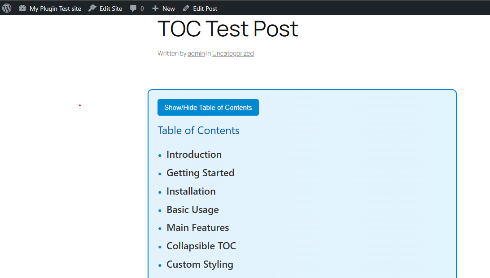

 Simple TOC Generator

A WordPress plugin that automatically generates a collapsible Table of Contents (TOC) from `<h2>` and `<h3>` headings in your posts.
## 📸 Screenshots

### ✅ TOC Appearing in a WordPress Post

Features

- Auto‑detects H2 and H3 tags
- Clickable anchor links for fast navigation
- Collapsible TOC with a “Show/Hide” toggle button
- Smooth animations and polished styling
- Lightweight and easy to integrate

## Installation

1. Clone or download this repository into:
  git clone git remote add origin https://github.com/palak0505/simple-toc-generator.git
